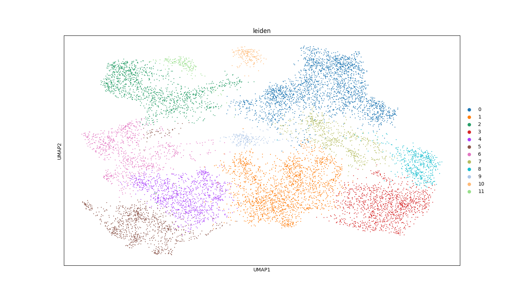
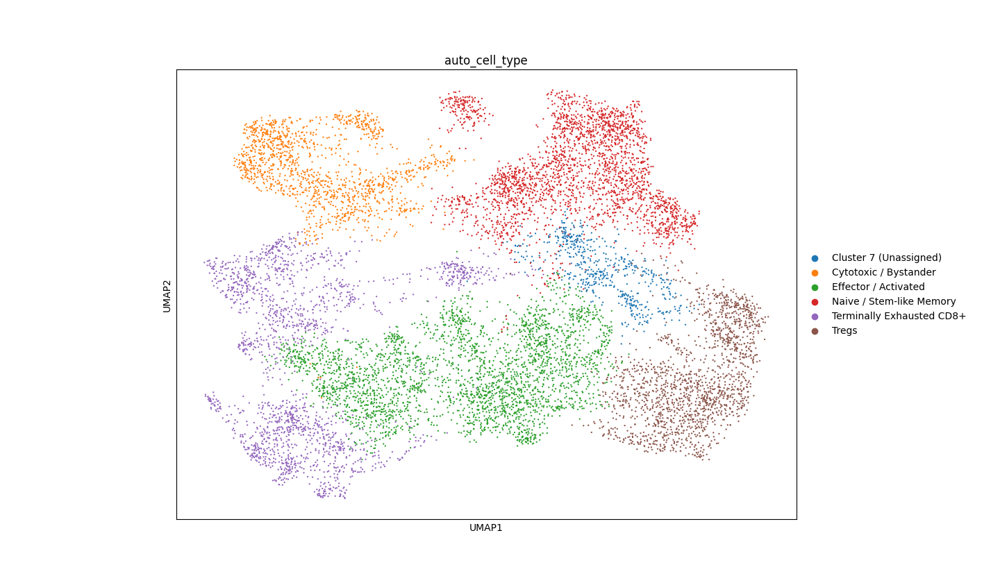
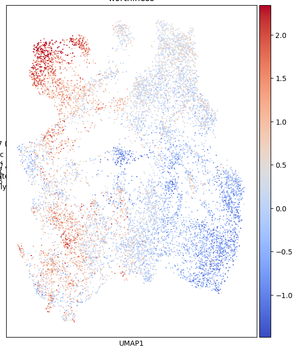
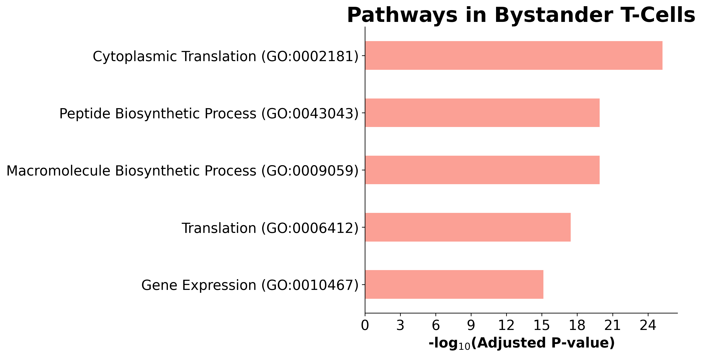

# Tumor-T-Cell-Action
The growth of tumors attracts a response by the immune system in the form of T-Cells. T-Cells struggle to deal with tumors due to a variety of complications, resulting in terminal exhaustion characterized by loss of function and proliferative capacity. However, solid tumors frequently harbor large infiltrates of non-exhausted bystander T-Cells with intact cytolytic potential.

This project aims to use public data regarding the composition of cells at a tumor site (Colorectal Cancer) to identify not only bystander T-Cells but also compare them to their accompanying exhausted T-Cells to quantify a T-Cell Engager Worthiness Score. This metric scores single cells based on preserved cytotoxic machinery and CD3 receptor availability against the absence of co-inhibitory checkpoint receptors. All code is in `data_analysis.py`.

## Gene & Cell Analysis
Grouping Cells from the Original Dataset



Categorizing the Groupings based on Genes (Bystander, Exhausted found)



T-Cell Engager Worthiness Score



Gene Pathway Information



## Dataset & Dataset Structure
[Series-GSE108989-Colorectal-Cancer](https://www.ncbi.nlm.nih.gov/geo/query/acc.cgi?acc=GSE108989)

| Column Name | Type | Description |
| :--- | :--- | :--- |
| **`geneID`** | `int64` | Entrez / NCBI Gene ID |
| **`symbol`** | `object` / `str` | HGNC Gene Symbol |
| **`<Cell_Barcode_1>`** | `int64` | Raw transcript (UMI) count in Cell 1 |
| **`<Cell_Barcode_2>`** | `int64` | Raw transcript (UMI) count in Cell 2 |
| **`...`** | `int64` | Raw transcript (UMI) count in Cell *N* |

* **Rows:** Individual genes indexed by identifier and gene symbol.
* **Columns (from column 3 onward):** Individual single-cell barcodes (`NP###-YYYYMMDD`).
* **Matrix Values:** Raw non-negative integer transcript counts (UMI).

## Requirements
```
scanpy==1.9.8
pandas==2.0.3
numpy==1.24.4
scipy==1.10.1
gseapy==0.14.0
matplotlib==3.7.5
leidenalg==0.10.2
umap-learn==0.5.7
h5py==3.11.0
```
